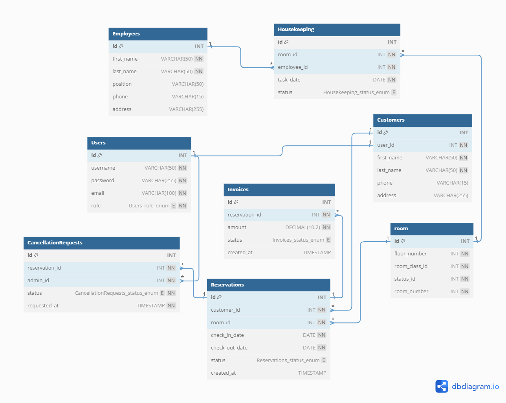

# Hotel-management-system

A Spring Boot-based Hotel Management System that streamlines operations for hotel staff and guests with functionalities
for reservations, customer and employee management, room management, housekeeping, billing, and role-based access 
control.

> [!NOTE]
> Maybe there is some missing information or bugs in the code or the documentation,
> i will update it as soon as possible, if you find any issue please open an issue or contact me.


<p align="center">
    
    
    
</p>
<br>
<p align="center">
    <a href="https://www.buymeacoffee.com/om4r">
        
    </a>
</p>

## Table of Contents
- [🧰 Resources](#-resources)
- [✏ ERD's and Diagrams](#-erds-and-diagrams)
- [📋 API Endpoints](#-api-endpoints)
- [OpenAPI Documentation](#openapi-documentation)
- [Postman Collection](#postman-collection)
- [📦 Running the project](#-running-the-project)
  - [🔧 Command Line ](#-command-line)
  - [🔧 Docker](#-docker)
- [Docker Hub Image](#docker-hub-image)


## 🧰 Resources
The project have the following resources:
- ***Rooms***: For Operations related to rooms.

- ***Customers***: For Operations related to customers.

- ***Employees***: For Operations related to employees.

- ***Reservations***: For Operations related to reservations.

- ***Housekeeping***: For Operations related to housekeeping.

- ***Invoices***: For Operations related to invoices.

- ***Cancellation Requests***: For Operations related to cancellation requests.

## ✏ ERD's and Diagrams
The Database ERD is as follows:



## 📋 API Endpoints

### Rooms
- **GET** `/api/v1/rooms`: Get all rooms.

- **GET** `/api/v1/rooms/{id}`: Get room by id.

- **POST** `/api/v1/rooms`: Create a new room.
- **PUT** `/api/v1/rooms/{id}`: Update room by id.
- **DELETE** `/api/v1/rooms/{id}`: Delete room by id.
- **GET** `/api/v1/rooms/search`: Search rooms by rooms parameters.
    - **Parameters**:
        - `floorNumber`: Floor number of the room.
        - `roomStatus`: Status of the room.
        - `roomNumber`: Room number.
        - `bedNumber`: Number of beds in the room.
        - `info` : Additional information about the room.

### Customers
- **GET** `/api/v1/customers`: Get all customers.
- **GET** `/api/v1/customers/{id}`: Get customer by id.
- **POST** `/api/v1/customers`: Create a new customer.
- **PUT** `/api/v1/customers/{id}`: Update customer by id.
- **DELETE** `/api/v1/customers/{id}`: Delete customer by id.
- **GET** `/api/v1/customers/search`: Search customers by customer parameters.
    - **Parameters**:
        - `firstName`: First name of the customer.
        - `lastName`: Last name of the customer.
        - `phone`: Phone number of the customer.
        - `address`: Address of the customer.

### Employees
- **GET** `/api/v1/employees`: Get all employees.
- **GET** `/api/v1/employees/{id}`: Get employee by id.
- **POST** `/api/v1/employees`: Create a new employee.
- **PUT** `/api/v1/employees/{id}`: Update employee by id.
- **DELETE** `/api/v1/employees/{id}`: Delete employee by id.
- **GET** `/api/v1/employees/search`: Search employees by employee parameters.
    - **Parameters**:
        - `firstName`: First name of the employee.
        - `lastName`: Last name of the employee.
        - `phone`: Phone number of the employee.
        - `address`: Address of the employee.
        - `position`: Position of the employee.

### Reservations
- **GET** `/api/v1/reservations`: Get all reservations.
- **GET** `/api/v1/reservations/{id}`: Get reservation by id.
- **POST** `/api/v1/reservations`: Create a new reservation.
- **PUT** `/api/v1/reservations/{id}`: Update reservation by id.
- **DELETE** `/api/v1/reservations/{id}`: Delete reservation by id.
- **GET** `/api/v1/reservations/search`: Search reservations by reservation parameters.
    - **Parameters**:
        - `roomId`: Room ID of the reservation.
        - `customerId`: Customer ID of the reservation.
        - `status`: Status of the reservation.
        - `checkInDate`: Check-in date of the reservation.
        - `checkOutDate`: Check-out date of the reservation.
        - `expectedArrivalTime`: Expected arrival time of the reservation.
        - `expectedLeavingTime`: Expected departure time of the reservation.
      
### Housekeeping
- **GET** `/api/v1/housekeeping`: Get all housekeeping tasks.
- **GET** `/api/v1/housekeeping/{id}`: Get housekeeping task by id.
- **POST** `/api/v1/housekeeping`: Create a new housekeeping task.
- **PUT** `/api/v1/housekeeping/{id}`: Update housekeeping task by id.
- **DELETE** `/api/v1/housekeeping/{id}`: Delete housekeeping task by id.
- **GET** `/api/v1/housekeeping/search`: Search housekeeping tasks by housekeeping task parameters.
    - **Parameters**:
        - `roomId`: Room ID of the housekeeping task.
        - `employeeId`: Employee ID of the housekeeping task.
        - `status`: Status of the housekeeping task.
        - `taskDate`: Date of the housekeeping task.

### Invoices
- **GET** `/api/v1/invoices`: Get all invoices.
- **GET** `/api/v1/invoices/{id}`: Get invoice by id.
- **POST** `/api/v1/invoices`: Create a new invoice.
- **PUT** `/api/v1/invoices/{id}`: Update invoice by id.
- **DELETE** `/api/v1/invoices/{id}`: Delete invoice by id.
- **GET** `/api/v1/invoices/search`: Search invoices by invoice parameters.
    - **Parameters**:
        - `reservationId`: Reservation ID of the invoice.
        - `amount`: Total amount of the invoice.
        - `status`: Status of the invoice.
  
### Cancellation Requests
- **GET** `/api/v1/CancellationRequest`: Get all cancellation requests.
- **GET** `/api/v1/CancellationRequest/{id}`: Get cancellation request by id.
- **POST** `/api/v1/CancellationRequest`: Create a new cancellation request.
- **PUT** `/api/v1/CancellationRequest/{id}`: Update cancellation request by id.
- **DELETE** `/api/v1/CancellationRequest/{id}`: Delete cancellation request by id.
- **POST** `/api/v1/CancellationRequest/{id}/approve`: Approve cancellation request by id.
- **POST** `/api/v1/CancellationRequest/{id}/reject`: Reject cancellation request by id.
- **GET** `/api/v1/CancellationRequest/search`: Search cancellation requests by cancellation request parameters.
    - **Parameters**:
        - `reservationId`: Reservation ID of the cancellation request.
        - `status`: Status of the cancellation request.
        - `customerId`: Customer ID of the cancellation request.

## OpenAPI Documentation

<p align="center">
    
</p>


The OpenAPI documentation can be accessed at `/swagger-ui.html` endpoint.


## Postman Collection

<p align="center">
    
</p>

- The Postman collection is in the following file [Postman Collection](./hms.json)


## 📦 Running the project

### 🔧 Command Line
1. Clone the repository:
```bash
git clone
```

2. Change directory:
```bash
cd hotel-management-system
```

3. Run the project:
```bash
./gradlew bootRun
```

### 🔧 Docker
1. there is Docker file and docker-compose file in the project, you can run the project using docker-compose:
```bash
docker-compose up
```

## Docker Hub Image
the link to the docker image is [here](https://hub.docker.com/r/omarxq/hotel-managment-system)
The Docker image is available on Docker Hub, you can pull the image using the following command:
```bash
docker pull omarxq/hotel-management-system
```

